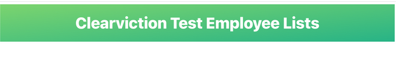
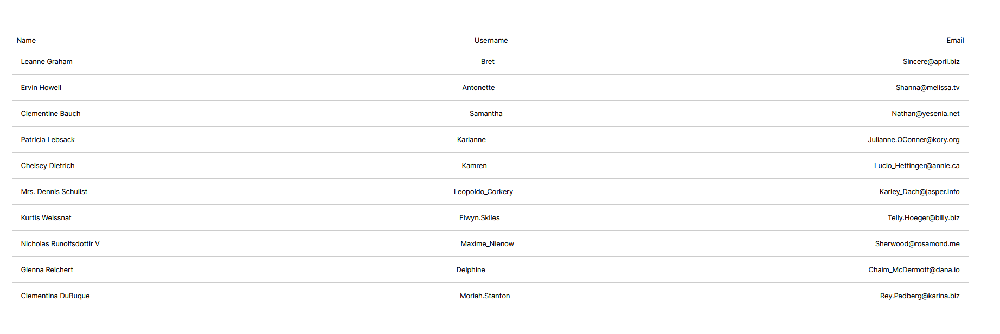
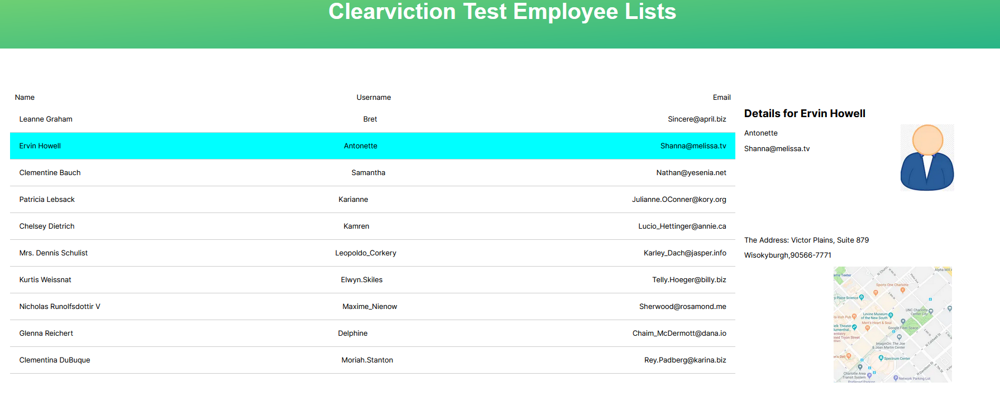
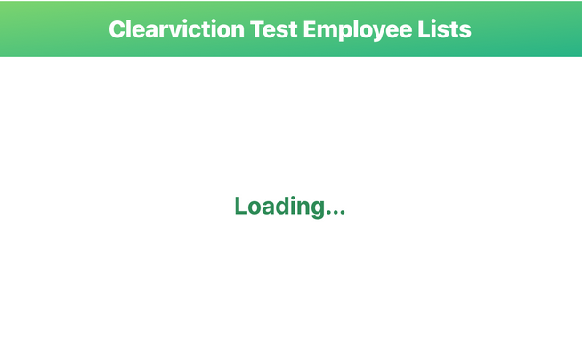
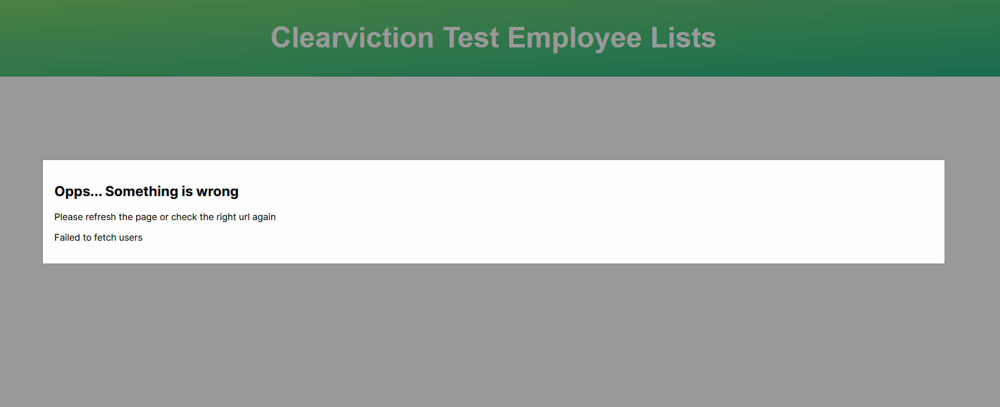

This is a test for Clearviction. Based on ReactJS and using NextJS as a tiny back-end for demo. Now let's see how it works.


## See the demo online

For your convience, I already deploy this project on the Vercel. And you may want to see my demo by click this [demo Link](https://api-test-alpha-eight.vercel.app/)

## Getting Started

If you want to deploy by yourself, you can do the following steps.

```bash
git clone https://github.com/Lanceart/api-test.git
# then go into the proejct
npm install .
# compile and run
npm run dev

```
Open [http://localhost:3000](http://localhost:3000) with your browser to see the result.


## The details in my project
The page.js is the Home for all the component, and the web API also fetched by here. I seperate all the components into the /componets
And also I add more function, when you click one item in the list you gonna see the detail information in the right hand side. Also if you click it again it gonna disapear.

The page.js file serves as the central hub for all components, essentially functioning as the heart of our application. It's in this core file where we also handle fetching data from web APIs, ensuring a external data sources. To maintain a clean and organized codebase, I've partitioned each component into a components directory.

Moreover, I've enriched the user experience with interactive functionalities. For instance, clicking on an item in the list triggers a display of detailed information on the right-hand side of the screen. This feature enhances user engagement by providing immediate access to additional data. Further adding to the intuitive nature of our interface, a second click on the same item cleverly makes the detailed information vanish.
- Header


-UserList


-LoadingIndicator


- ErrorDisplay

if you want to see if the ErrorDisplay works, you can do the following steps. First change the line of url in app/page.js

```javascript
const response = await fetch(`https://jsonplaceholder.typicode.com/users`);
```
Then refresh the page you gonna see the following page.



